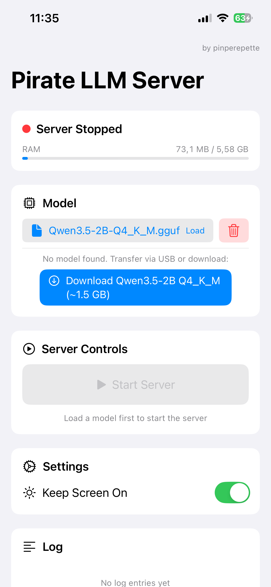
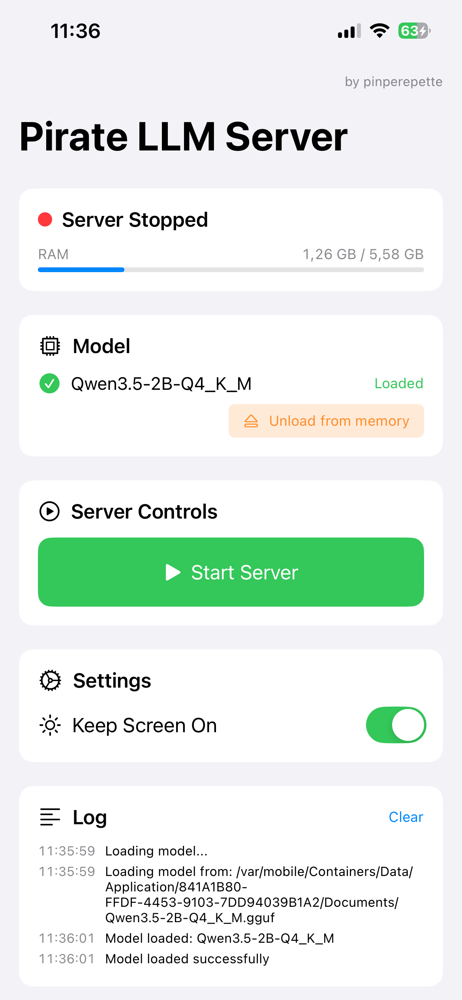
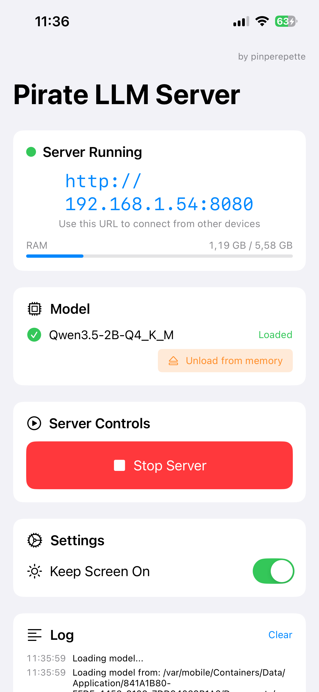
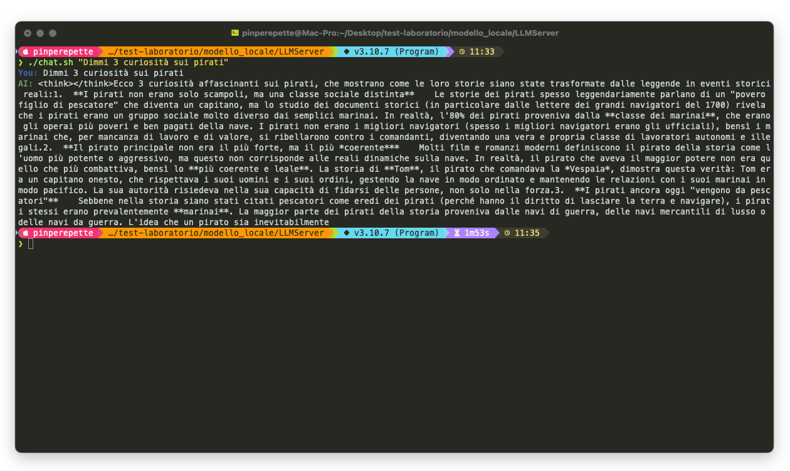

# Pirate LLM Server

Turn your iPhone into a local LLM server with an OpenAI-compatible API. Run any GGUF model on-device with Metal GPU acceleration and serve it over your local network.

No cloud. No subscriptions. No jailbreak. Just your iPhone and a model.

<p align="center">
  
  
  
</p>

<p align="center">
  
</p>

## Features

- **OpenAI-compatible API** — `POST /v1/chat/completions`, `GET /v1/models`
- **Streaming (SSE)** and non-streaming responses
- **Metal GPU acceleration** via llama.cpp for fast inference on Apple Silicon
- **Any GGUF model** — load models via USB transfer or download directly in-app
- **Model management** — load, unload, and delete models from the UI
- **Real-time logs** — monitor requests and generation in the app
- **Background keep-alive** — silent audio trick to prevent iOS from killing the app
- **Keep Screen On** toggle to prevent sleep
- **RAM usage indicator** in real-time
- **CORS enabled** — connect from any web client on your network

## Requirements

- iPhone or iPad (tested on iPhone 14, 6GB RAM)
- Xcode 15+ on macOS
- A GGUF model file (e.g. Qwen3.5-2B Q4_K_M ~1.5GB)
- Free Apple Developer account (app must be re-signed every 7 days)

## Quick Start

### 1. Clone and build

```bash
git clone https://github.com/pinperepette/PirateLLMServer.git
cd PirateLLMServer

# Build llama.cpp as a dynamic XCFramework for iOS
./setup.sh
```

### 2. Open in Xcode

```bash
open LLMServer.xcodeproj
```

- Select your iPhone as the build target
- Set your signing team in **Signing & Capabilities**
- Press **Cmd+R** to build and install

### 3. Transfer a model

**Option A — USB (fastest):**
1. Open Finder → click your iPhone → Files → LLMServer
2. Drag your `.gguf` file into the app folder

**Option B — In-app download:**
- Tap "Download Qwen3.5-2B Q4_K_M" button in the app

### 4. Start the server

1. Tap **Load** next to your model
2. Tap **Start Server**
3. Note the URL displayed (e.g. `http://192.168.1.54:8080`)

### 5. Send requests

```bash
# Non-streaming
curl http://<iphone-ip>:8080/v1/chat/completions \
  -H "Content-Type: application/json" \
  -d '{"model":"qwen3.5-2b","messages":[{"role":"user","content":"Hello!"}],"max_tokens":200}'

# Streaming
curl http://<iphone-ip>:8080/v1/chat/completions \
  -H "Content-Type: application/json" \
  -d '{"model":"qwen3.5-2b","messages":[{"role":"user","content":"Hello!"}],"max_tokens":200,"stream":true}'
```

A convenience `chat.sh` script is included for pretty terminal output:

```bash
./chat.sh "Tell me 3 fun facts about pirates"
```

## API Reference

### POST /v1/chat/completions

OpenAI-compatible chat completion endpoint.

**Request:**
```json
{
  "model": "qwen3.5-2b",
  "messages": [
    {"role": "system", "content": "You are a helpful assistant."},
    {"role": "user", "content": "Hello!"}
  ],
  "max_tokens": 512,
  "temperature": 0.7,
  "stream": false
}
```

**Response:**
```json
{
  "id": "chatcmpl-xxx",
  "object": "chat.completion",
  "model": "qwen3.5-2b",
  "choices": [{
    "index": 0,
    "message": {"role": "assistant", "content": "Hello! How can I help you?"},
    "finish_reason": "stop"
  }],
  "usage": {"prompt_tokens": 10, "completion_tokens": 8, "total_tokens": 18}
}
```

### GET /v1/models

Returns the list of loaded models.

### GET /

Status page showing server state and available endpoints.

## Architecture

```
┌─────────────────────────────────────┐
│            iPhone (iOS)             │
│                                     │
│  ┌───────────┐   ┌──────────────┐   │
│  │  SwiftUI  │   │ GCDWebServer │   │
│  │   (UI)    │◄──│ (HTTP :8080) │◄──── Local network requests
│  └─────┬─────┘   └──────┬───────┘   │
│        │                │            │
│        ▼                ▼            │
│  ┌──────────────────────────┐        │
│  │       LLMEngine          │        │
│  │   (llama.cpp + Metal)    │        │
│  └──────────┬───────────────┘        │
│             ▼                        │
│  ┌──────────────────────────┐        │
│  │    model.gguf            │        │
│  │  (Documents sandbox)     │        │
│  └──────────────────────────┘        │
└─────────────────────────────────────┘
```

## Project Structure

```
LLMServer/
├── LLMServerApp.swift           # Entry point + AppState
├── Engine/
│   └── LLMEngine.swift          # llama.cpp wrapper (tokenize, decode, sample)
├── Server/
│   ├── APIServer.swift          # HTTP server + OpenAI routes
│   └── OpenAIModels.swift       # Request/response Codable models
├── Model/
│   └── ModelManager.swift       # GGUF file management + download
├── Views/
│   └── ContentView.swift        # SwiftUI interface
├── Utils/
│   ├── BackgroundKeepAlive.swift # Silent audio to prevent app suspension
│   └── NetworkInfo.swift        # RAM usage + IP address helpers
└── Info.plist                   # Network permissions + file sharing
```

## Dependencies

- **[llama.cpp](https://github.com/ggml-org/llama.cpp)** — LLM inference engine with Metal support (built as XCFramework)
- **[GCDWebServer](https://github.com/readium/GCDWebServer)** — Lightweight HTTP server for iOS (via SPM)

## Recommended Models

| Model | Size | RAM needed | Notes |
|-------|------|-----------|-------|
| Qwen3.5-0.8B Q4_K_M | ~0.6 GB | ~2 GB | Very fast, lower quality |
| **Qwen3.5-2B Q4_K_M** | **~1.5 GB** | **~3 GB** | **Best balance for 6GB devices** |
| Qwen3.5-4B Q4_K_M | ~2.8 GB | ~5 GB | Better quality, needs 8GB+ |

## Tips

- **Keep the app in foreground** — iOS will suspend background apps. The silent audio trick helps but keeping the screen on is more reliable.
- **USB transfer is faster** than downloading multi-GB models over WiFi.
- **Free Apple accounts** require re-signing the app every 7 days.
- If the app crashes on load, try a **smaller model** or a **more aggressive quantization** (Q2_K, IQ4_XS).

## License

MIT

## Author

**pinperepette**
